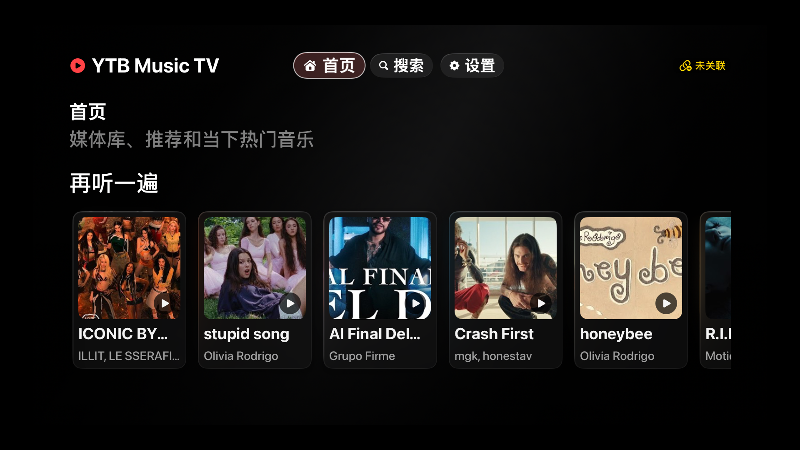

# YTB Music TV

面向 Apple TV 的 YouTube Music 客户端。项目由 SwiftUI tvOS App 和可通过 Docker 部署的 Node.js 服务端组成：客户端负责浏览、播放与遥控器交互，服务端负责访问 YouTube Music、解析媒体流、代理播放地址和局域网发现。

> 当前为早期版本，需要自签安装。YouTube Music 接口和媒体流规则可能随上游变化。



## 功能

### tvOS 客户端

- 首页聚合媒体库、推荐和热门内容
- 搜索歌曲，并继续浏览专辑、歌单和音乐人
- 基于 `AVPlayer` 的音视频播放、进度跳转、上一首/下一首
- 播放队列、历史、随机播放、单曲循环、喜欢与不喜欢状态
- Siri Remote、系统媒体命令和 App Intent 快捷入口
- 自动发现局域网服务端，也可手动填写 HTTP/HTTPS 地址
- 六位设备码关联，访问令牌持久化到 Apple TV
- 中英文界面，可跟随系统语言

### 服务端

- 通过 `youtubei.js` 获取搜索、首页、Explore、媒体库和详情数据
- 无状态媒体解析和支持 Range 请求的媒体代理
- 视频优先、画质选择及音频回退
- 广告域名/路径过滤和“不喜欢歌曲自动跳过”配置
- UDP 局域网发现和持久化设备身份
- 匿名访问公共目录；通过 Google 设备 OAuth 访问个人媒体库

播放进度、队列、历史、随机/循环和当前播放状态只保存在客户端。服务端不维护播放器会话。

## 项目结构

```text
ytb-music-tv/
├── client-tvos/             # SwiftUI tvOS 客户端、资源和构建脚本
│   ├── Sources/YTBMusicTVClient/
│   ├── Assets.xcassets/
│   └── build-ipa.sh
├── server/                  # Node.js HTTP/UDP 服务端
│   ├── src/
│   └── test/
├── scripts/                 # Docker Compose 辅助命令
├── data/                    # Docker 部署时的持久化数据（已忽略）
└── docker-compose.yml
```

## 环境要求

- 服务端：Node.js 22+、pnpm 10+
- 容器部署：Docker 和 Docker Compose
- tvOS 客户端：macOS、Xcode 和 tvOS SDK；最低部署目标为 tvOS 17.0

仓库没有 `.xcodeproj`。`client-tvos/build-ipa.sh` 会直接编译 Swift 源码、资源目录和 App Intents 元数据。

## 快速开始

### 1. 启动服务端

推荐使用 Docker：

```bash
./scripts/docker-compose.sh up --build -d
./scripts/docker-compose.sh logs -f ytb-music-tv-server
```

该包装命令会把宿主机 UID/GID 传给容器，确保 `data/` 中生成的文件属于当前用户。

服务启动后可检查：

```bash
curl http://127.0.0.1:4174/api/health
```

也可以直接运行：

```bash
cd server
pnpm install
pnpm start
```

直接运行时默认只监听 `127.0.0.1`；若 Apple TV 需要通过局域网访问，请显式监听所有网卡：

```bash
YTB_MUSIC_TV_HOST=0.0.0.0 pnpm start
```

### 2. 在 tvOS 模拟器运行

先在 Xcode 的 Simulator 中启动一台 Apple TV，然后执行：

```bash
cd client-tvos
BUILD_FOR_SIMULATOR=1 CONFIGURATION=Debug ./build-ipa.sh
xcrun simctl list devices booted
```

将下面的 `<UDID>` 替换为已启动的 Apple TV 模拟器 ID：

```bash
xcrun simctl install <UDID> build/Debug-AppleTVSimulator/YTBMusicTV.app
SIMCTL_CHILD_YTB_MUSIC_TV_SERVER_URL=http://127.0.0.1:4174 \
  xcrun simctl launch <UDID> com.ytb.music.tv
```

在真机上可由“设置”页面选择自动发现的服务端，或填写 Mac/服务器的局域网地址，例如 `http://192.168.1.10:4174`。`127.0.0.1` 在真机上指向 Apple TV 自身，不能用于连接其他设备。

### 3. 关联设备

服务端首次启动会生成并持久化六位设备码，同时输出到日志：

```text
YTB Music TV device code: 123456
```

在 App 的“设置 → 设备关联”中输入该设备码。未关联设备仍可访问公共内容；关联用于识别客户端并保存服务端签发的访问令牌。

## Google OAuth 登录（推荐）

个人歌曲、播放列表、专辑、艺人和再次收听内容通过带 OAuth Bearer token 的 YouTube TV Music surfaces 获取。服务端会动态发现 YouTube TV 使用的 OAuth Client，不要求用户创建 Google Cloud 项目或 Client ID，也不依赖该共享 Client 无法启用的 YouTube Data API。该兼容模式会申请 `youtube` scope；环境变量 `YTB_MUSIC_TV_OAUTH_CLIENT_ID` 和 `YTB_MUSIC_TV_OAUTH_CLIENT_SECRET` 仅用于需要固定自有 Client 时覆盖自动发现结果，并默认申请只读 scope。

直接在服务端目录执行设备登录：

```bash
cd server
node src/cli/oauth-login.js
```

也可以在运行中的 Docker Compose 服务里执行：

```bash
./scripts/docker-compose.sh exec ytb-music-tv-server \
  node src/cli/oauth-login.js
```

命令会显示 Google 验证地址和设备码。授权成功后，refresh token 会以 `0600` 权限保存到服务端数据目录的 `oauth.json`；运行中的服务会自动重新加载文件，不需要重启。

如果通过环境变量覆盖为自有 OAuth Client，且项目仍处于 Google Cloud 的 Testing 状态，refresh token 可能在七天后过期。

运行时不读取或发送浏览器 Cookie。公开搜索和首页使用匿名 Innertube 会话；个人媒体库和需要登录的播放信息只使用可自动刷新的 OAuth token。`poToken` 和 `visitorData` 仍可作为匿名播放兼容参数，但不承担账号鉴权。

## 配置

服务端环境变量：

| 变量 | 默认值 | 说明 |
| --- | --- | --- |
| `YTB_MUSIC_TV_HOST` | `127.0.0.1` | HTTP 监听地址 |
| `YTB_MUSIC_TV_PORT` | `4174` | HTTP API 端口 |
| `YTB_MUSIC_TV_DISCOVERY_PORT` | `4175` | UDP 局域网发现端口 |
| `YTB_MUSIC_TV_DATA_DIR` | `server/data` | 配置、会话和缓存目录 |
| `YTB_MUSIC_TV_SERVER_NAME` | 当前主机名 | 客户端显示的服务端名称 |
| `YTB_MUSIC_TV_OAUTH_CLIENT_ID` | 自动发现 | 可选的 OAuth Client ID 覆盖 |
| `YTB_MUSIC_TV_OAUTH_CLIENT_SECRET` | 自动发现 | 可选的 OAuth Client Secret 覆盖 |
| `YTB_MUSIC_TV_LIBRARY_MAX_ITEMS` | `200` | 每类官方 Library 内容的最大条数 |
| `YTB_MUSIC_TV_UID` | `1000` | Docker 容器运行 UID；辅助脚本自动使用当前用户 |
| `YTB_MUSIC_TV_GID` | `1000` | Docker 容器运行 GID；辅助脚本自动使用当前用户 |

Docker Compose 将 TCP `4174` 和 UDP `4175` 暴露到宿主机，并把根目录的 `data/` 挂载到容器 `/data`。建议始终通过 `scripts/docker-compose.sh` 执行 Compose，或在 `.env` 中手动设置 UID/GID。

客户端可通过进程环境变量 `YTB_MUSIC_TV_SERVER_URL` 注入首次连接地址；之后也可在设置页修改。播放偏好、广告过滤和跳过不喜欢歌曲等配置会通过服务端 API 立即保存。

## API 概览

| 方法 | 路径 | 用途 |
| --- | --- | --- |
| `GET` | `/api/health` | 健康、关联和 YouTube 会话状态 |
| `GET/PATCH` | `/api/config` | 读取或更新公开功能与播放配置 |
| `POST` | `/api/pair` | 使用六位设备码关联客户端 |
| `GET` | `/api/home`、`/api/explore`、`/api/library` | 首页和媒体库内容 |
| `GET` | `/api/search?q=...&type=song` | 搜索内容 |
| `GET` | `/api/search/suggestions?q=...` | 搜索建议 |
| `POST` | `/api/browse` | 浏览歌曲、专辑、歌单或音乐人 |
| `GET` | `/api/playlist/:playlistId` | 歌单详情 |
| `GET` | `/api/media/:videoId` | 单个媒体详情 |
| `GET` | `/api/media/:videoId/related` | 相关内容 |
| `GET` | `/api/resolve/:videoId` | 解析媒体流信息 |
| `GET/HEAD` | `/api/stream/:videoId` | 支持 Range 的媒体代理 |
| `POST` | `/api/adblock/check` | 检查 URL 是否命中过滤规则 |
| `GET` | `/api/proxy?url=...` | 受过滤规则保护的通用代理 |

## 构建 tvOS IPA

生成未签名 IPA：

```bash
cd client-tvos
./build-ipa.sh
```

默认产物为 `client-tvos/build/YTBMusicTV-tvOS.ipa`。真机安装必须使用匹配 Bundle ID 的 tvOS provisioning profile 和签名证书；可用参数及示例见 [`client-tvos/README.md`](client-tvos/README.md)。

## 测试

```bash
cd server
pnpm test
```

验证客户端完整模拟器构建：

```bash
cd client-tvos
BUILD_FOR_SIMULATOR=1 CONFIGURATION=Debug ./build-ipa.sh
```

## 安全说明

Docker 配置会把 HTTP API 暴露到 `0.0.0.0`，且当前公共目录与配置接口不强制鉴权。请仅部署在可信局域网，不要把 `4174` 端口直接暴露到公网。若需要远程访问，应在前置代理中增加 TLS、访问控制和来源限制。

本项目与 YouTube/Google 无关联。使用前请确认你的部署、账号和内容访问方式符合所在地区的法律及相关服务条款。
